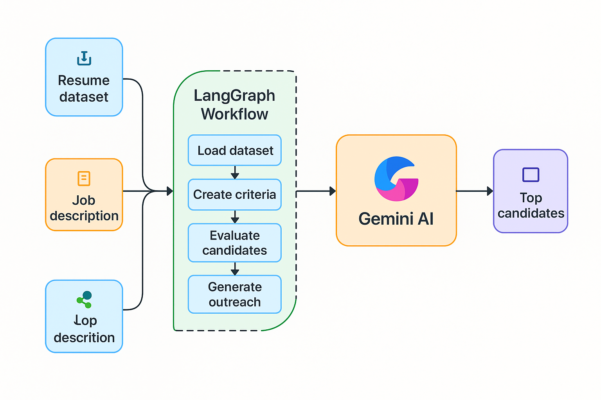

# 🤖 LangGraph AI Recruiting Agent

This project is an **AI-powered recruitment assistant** that uses **LangGraph + Gemini AI** to:

✅ Parse job descriptions  
✅ Score and rank resume datasets from Kaggle  
✅ Select the top 3 candidates  
✅ Generate personalized outreach emails

🛠️ Built using:
- LangGraph (workflow engine)
- Google Gemini Pro (LLM)
- KaggleHub (resume dataset)
- Streamlit (frontend)

---

## 🚀 Live Demo

👉 **Try it now:** [https://recruitment-agent-ai.streamlit.app](https://recruitment-agent-ai.streamlit.app)

---

## 📖 Blog Post

📝 I explained the full architecture, scoring logic, and decisions in this blog:  
[🔗 I built an AI Recruiter with LangGraph and Gemini](https://medium.com/@prasadio/i-built-an-ai-recruiter-with-langgraph-and-gemini-and-you-can-too-7dac7df8b91e)

---

## 📸 App Architecture

](https://user-images.githubusercontent.com/image.png)

---

## 🧠 Architecture & Logic

### LangGraph Workflow
1. `load_dataset`: Load & clean Kaggle resume data
2. `create_criteria`: Extract scoring criteria using LLM
3. `evaluate_candidates`: Score candidates across:
   - Technical skills
   - Experience
   - Education
   - Career alignment
4. `rank_candidates`: Pick top 3 by score
5. `generate_outreach`: Write personalized emails
6. `compile_results`: Package final result

### Scoring Weights

| Category         | Weight |
|------------------|--------|
| Technical Skills | 40%    |
| Experience       | 30%    |
| Education        | 20%    |
| Alignment        | 10%    |

---

## 🐳 Run Locally with Docker

```
git clone https://github.com/prasadv26/langgraph-recruiting-agent.git
cd langgraph-recruiting-agent
docker build -t recruiting-agent-app .
docker run -p 8501:8501 recruiting-agent-app
Visit: http://localhost:8501
```

🧪 Run Locally (No Docker)
Install dependencies:

`pip install -r requirements.txt`

Set your Gemini API key:

`export GOOGLE_API_KEY=your_google_api_key`

Run the app:
`streamlit run recruiting_app.py`
```

📁 Folder Structure

recruiting-agent/
│
├── recruiting_app.py         # Streamlit UI
├── main_agent.py       # LangGraph logic
├── requirements.txt
├── Dockerfile
└── README.md


🧩 Dataset  
Powered by the public "Resume Dataset" available on Kaggle.  
Loaded via `kagglehub` — no manual setup required.

Loaded with kagglehub.

🧠 Suggestions to Scale
Use vector databases (e.g., Pinecone) for fuzzy skill matching

Switch to Gradio/Next.js for more UI control

Parallel evaluation using LangGraph nodes

Add resume file uploads (PDF parser)

🤝 Contributing
Pull requests are welcome. Feel free to fork, star, and share ideas!

📜 License
MIT License © Prasad Vispute